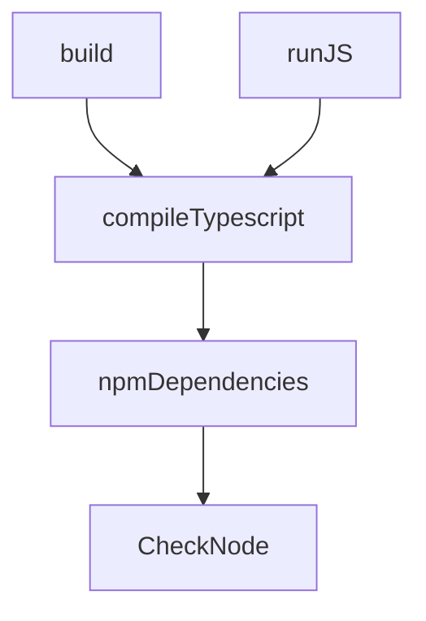

# Typescript Gradle Plugin

<!--
1. Rename the project in `settings.gradle.kts`
1. Change the project information in `build.gradle.kts`
1. Change the username for Maven Central in `.github/workflows/build-and-deploy.yml`
1. Configure the CI to have the following secrets set:
  * GRADLE_PUBLISH_KEY
  * GRADLE_PUBLISH_SECRET
  * MAVEN_CENTRAL_PASSWORD
  * SIGNING_KEY
-->

## Goal

Integrate typescript compilation in a gradle project.

## Description

The plugin allow to compile typescript files in a gradle project, producing javascript files from the typescript ones.
Also, it can be used to run directly the typescript file.

### Node

In addition, the plugin let you manage the node installation.
You can pick the version of node to install and the plugin will download it for you.

## Usage

Just apply it to your project:

```kotlin
plugins {
    id("io.github.zucchero-sintattico.typescript-gradle-plugin") version "<version>"
}
```

> Note: you should create a `package.json` and `tsconfig.json` in the root of your project with your desired configuration.

### Configuration

The plugin could be configured as follows (default values are shown):

```kotlin
typescript {
    entrypoint = "app.js"       // the entrypoint for execution within the output directory
    outputDir = "build/dist"    // the output directory
    tsConfig = "tsconfig.json"  // the tsconfig file
}

node {
    shouldInstall = false        // if true, the plugin will download the specified version of node

    // If specified both, zipUrl will be used
    zipUrl = ""                  // the url to download the node zip
    ---OR---
    version = "21.7.1"          // the version of node to download
}
```
### Available tasks

- `CheckNode`: checks if node is installed. If specified, it will download it.
- `npmDependencies`: installs the npm dependencies from the `package.json`.
- `compileTypescript`: compiles the typescript file. Output is in the `outputDir`.
- `runJS`: runs the javascript file specified in the `entrypoint`.
- `build`: alias for `compileTypescript`.

## Implementation

### Notes on the implementation

The critical part of the plugin is the node installation one.
The plugin will download the node distribution zip in a temporary directory and extract it in the project build directory.
Given that the node installation is a one-time operation, avoiding the download every time.
Instead, the plugin will check if the node is installed and skip the download if it is already there.

In order to get the exact path of the node installation at runtime every run, the plugin will save it in a file in the project build directory (`nodePaths.properties`).
This allow the plugin to get the path between different executions.

The shell command execution, in order to run typescript and node commands, is done using this utility [library](https://github.com/lordcodes/turtle).

### Tasks dependencies


